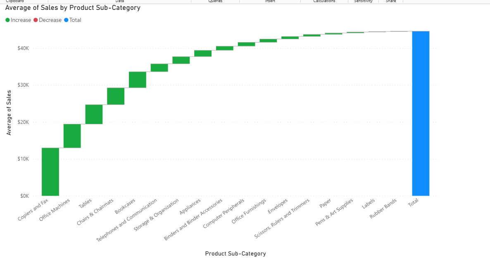
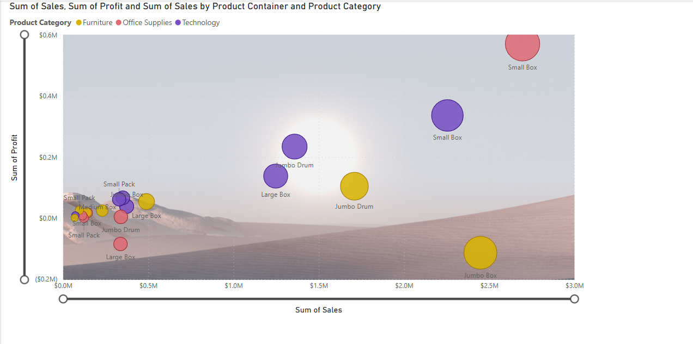
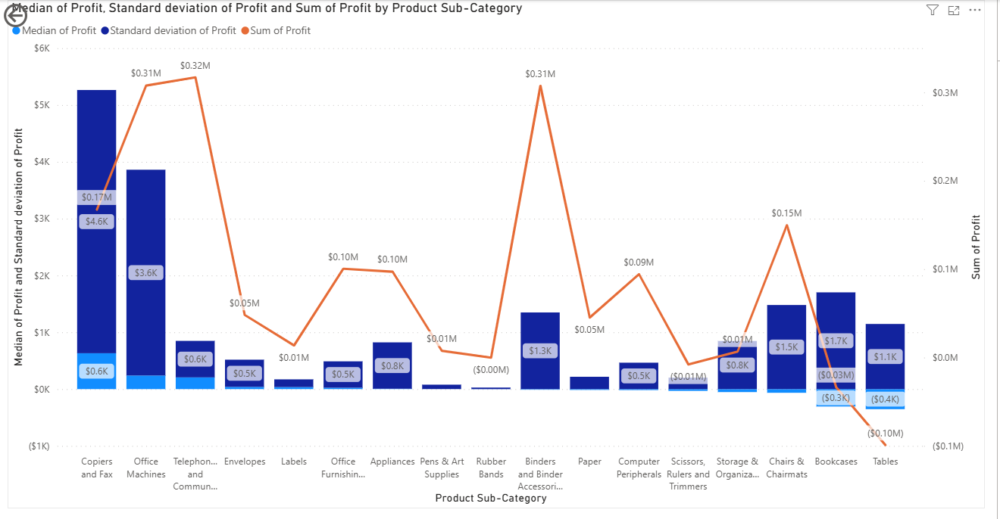
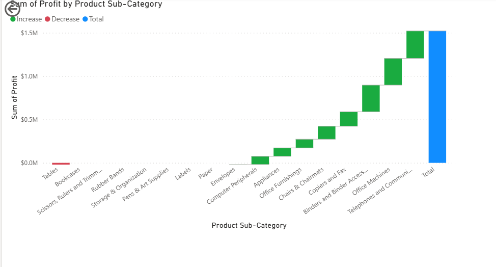
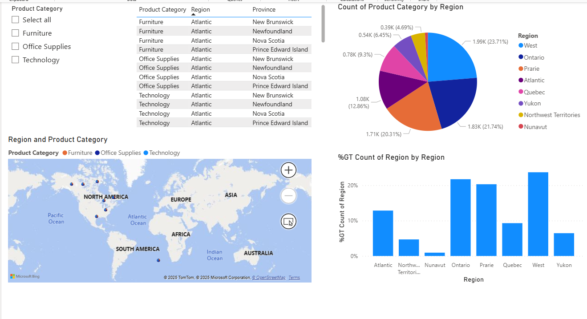
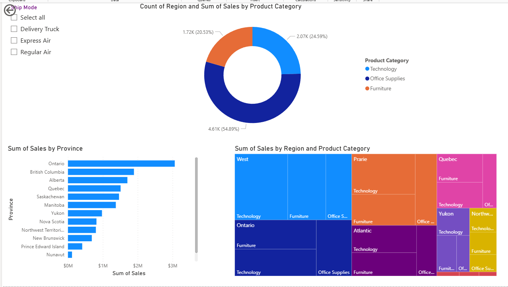
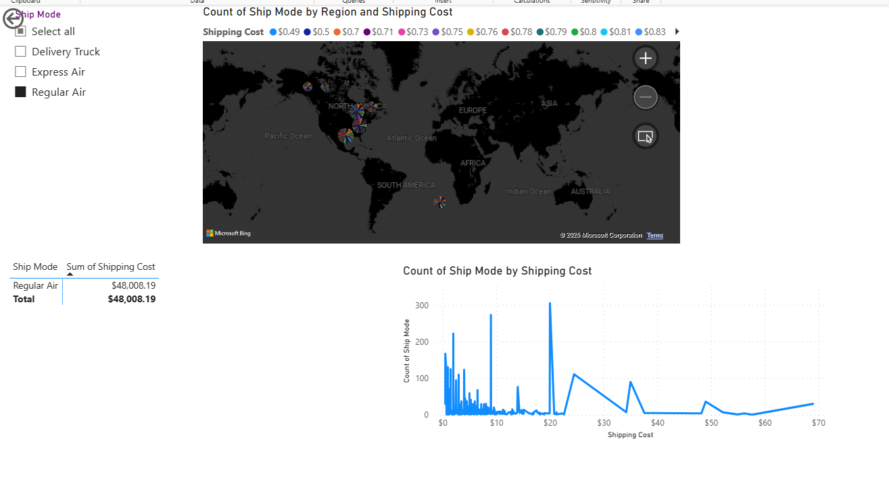
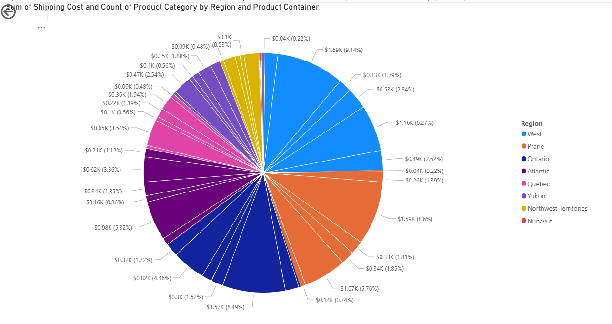

# PowerBI Sales, Profit & Packaging Analysis

An interactive Power BI dashboard for comprehensive analysis of:
- 📈 Sales performance  
- 💰 Profitability metrics  
- 📦 Packaging efficiency  
- 🚚 Shipping cost breakdown  
- 🌍 Regional sales trends

---

## 📊 Dashboard Visualizations

### 1. Sales Performance

#### 🔹 Average Sales by Product Sub-category  
  
*Description:* Shows normalized sales performance across different product types.

#### 🔹 Sales & Profit by Product Container  
  
*Description:* Reveals packaging and container-based efficiency metrics.

---

### 2. Profit Analysis

#### 🔹 Profit Distribution  
  
*Description:* Median and standard deviation analysis across sub-categories for deeper profitability insights.

#### 🔹 Profit by Sub-category  
  
*Description:* Visual breakdown of total profit per product sub-category.

---

### 3. Regional Metrics

#### 🔹 Product Count by Region  
  
*Description:* Breakdown of product categories across different regions.

#### 🔹 Sales by Province  
  
*Description:* Sales analysis per province and product category.

#### 🔹 Shipping Mode & Cost  
  
*Description:* Count of shipping modes per region and corresponding costs.

#### 🔹 Shipping Cost by Region & Container  
  
*Description:* Total shipping cost across region and product container types.

---

## 🛠️ Tools Used

- **Microsoft Power BI**
- **Power Query & DAX**
- **Data Modeling & Measures**

---

## 📁 Folder Structure

```plaintext
screenshots/
├── product_count_by_region.png
├── profit_by_subcategory.png
├── profit_distribution_by_subcategory.png
├── sales_by_province.png
├── sales_profit_by_container.png
├── ship_mode_by_region.png
├── shipping_cost_by_region_container.png
├── verage_sales_by_subcategory.png
